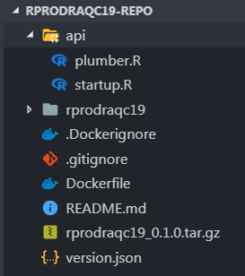

class: withheader

```{r setup, include=FALSE}
options(htmltools.dir.version = FALSE)
```

```{r xaringan-themer, include = FALSE}
library(xaringanthemer)
mono_accent(
  base_color = "#175dac",
  title_slide_text_color = "white",
  title_slide_background_color = "#175dac",
  title_slide_background_image = "logo_r_a_quebec_2019_presente_par_ia_blanc.png",
  title_slide_background_position = "90% 90%",
  title_slide_background_size = "200px",
  text_font_size = "18px",
  text_font_google = google_font("Fira Sans"),
  header_font_google = google_font("Quicksand"),
  code_font_google   = google_font("Inconsolata")
)
```
## C'est qui le monsieur en avant?

Conseiller expert en actuariat équipe de recherche et modélisation [@LaCapitale](https://www.lacapitale.com/fr/emplois/actuariat)

Actuariat ULaval 2007, FCAS, CSPA

[bruno.tremblay@lacapitale.com](mailto:bruno.tremblay@lacapitale.com)  
[github@meztez](https://github.com/meztezgithub@meztez)  
[linkedin@neoxone](https://www.linkedin.com/in/neoxone/)

R Community highlight : 
> La fois où Max Kuhn a accepté mon pull request. 


---
class: withheader

## Projet
Déployez une application pour utiliser un pipeline de modélisation prédictive

Ce qu'ils ont dit
> R c'est pas faite pour rouler en production  
> Python > R

Ce que j'en pense
> [Qualité du code + Composition de l'équipe] > Choix de language<sup>1</sup>

.footnote[[1] La plupart du temps]

---
class: withheader

## Architecture

<div style="float: left; height:8em; width: 8em; background-color: #92C744; text-align: center"></div>
<span style="float: left; margin:0.35em 0em 0.35em 0em; font-size:4em; width: 2em; text-align: center"> ⇴</span>
<div style="float: left; height:7.5em; width: 8em; background-color: #92C744; text-align: center; padding-top:0.5em"></div>
<span style="float: left; margin:0.35em 0em 0.35em 0em; font-size:4em; width: 2em; text-align: center"> ◇ </span>
<div style="float: left; height:7em; width: 8em; background-color: orange; text-align: center; padding-top: 1em"></div>
<span style="float: left; margin:0.35em 0em 0.35em 0em; font-size:4em; width: 2em; text-align: center"> ⇴ </span>
<div style="float: left; height:7.5em; width: 8em; background-color: orange; text-align: center; padding-top: 0.5em"></div>
<div style="clear: both;"></div>

## Outils

<div style="float: left; height:7em; width: 8em; background-color: #92C744; text-align: center; padding-top: 1em"></div>
<span style="float: left; margin:0.35em 0em 0.35em 0em; font-size:4em; width: 2em; text-align: center"> ◆ </span>
<div style="float: left; height:5.5em; width: 8em; background-color: #92C744; text-align: center; padding-top: 2.5em"></div>
<span style="float: left; margin:0.35em 0em 0.35em 0em; font-size:4em; width: 2em; text-align: center"> ◆ </span>
<div style="float: left; height:5.75em; width: 8em; background-color: #92C744; text-align: center; padding-top: 2.25em"></div>
<span style="float: left; margin:0.35em 0em 0.35em 0em; font-size:4em; width: 2em; text-align: center"> ◇ </span>
<div style="float: left; height:7.5em; width: 8em; background-color: orange; text-align: center; padding-top: 0.5em"></div>
<div style="clear: both;"></div>

???

# Avantages 
- Package R
 - Standard
 - Portable
 - Documentation
- Plumber
 - Facile à déployer
 - Simple à configurer, juste le conteneur, pas le apache
 - Conteneur :
  - Replicas : nombre d'appels concurrents max / 2 pour des appels de ~200ms
  - Mémoire : request la quantité utilisé par les libs / limit * 2 256/512
  - CPU : request 0.25, limit 2
- Docker
 - Persistance
 - Déploiement


---
class: withheader

## Structure du package<sup>1</sup>


- `data` : Objets nécessaires au pipeline enregistré avec le package.
- `data-raw` : Entraînement des modèles et expérimentations.
- `man` : Documentation générée par roxygen2.
- `R/onLoad.R` : Exécuté au chargement du package.
- `R/predict.R` : Fonctions de prédictions.
- `R/prepare.R` : Ingénierie des fonctionnalités.
- `R/transform.R` : Adapter les données reçues par l'API.
- `R/utils.R` : Autres fonctions dont le warmup.
- `R/validate.R` : Validations pré traitement.
- `tests` : Tests unitaires.
- `vignettes` : Exemples d'appels ou d'utilisation.
- `.gitignore` : Fichiers ignorés git.
- `.Rbuildignore` : Fichiers ignorés R BUILD.
- `.RData` : ...
- `.RHistory` : ...
- `DESCRIPTION` : Description du package.
- `NAMESPACE` : Générée par roxygen2.
- `rprodraqc19.Rproj` : ...

.footnote[[1] https://support.rstudio.com/hc/en-us/articles/200486488-Developing-Packages-with-RStudio]

???

onLoad : les objets vont être déjà monté en mémoire, réduit délai premier appel
predict : fonction exportée
prepare vs transform :
-transform c'est pour mettre les données de l'API sous le même format que les données de l'entraînement
-prepare c'est pour mettre les données dans un format utilisable pour le modèle
validate : s'assurer qu'on a toute l'information nécessaire pour effectuer le traitement.

---
class: withheader
## Pratico-pratique

```{r eval=FALSE}
library(profvis)
library(roxygen2)
library(opencpu)
debugonce()
browser()
plumber::plumb("plumber.R")$run # ou le bouton dans RStudio
```

#### Documenter avec `roxygen2`<sup>1</sup>

#### Identifier les trous noirs avec `profvis`<sup>2</sup>

#### Utiliser debug pour inspecter l'exécution

#### Valider l'API du package localement


.footnote[[1] `vignette("roxygen2", package = "roxygen2")`  
[2] https://rstudio.github.io/profvis  
[3] https://cloud.opencpu.org/ocpu/test/]

???

Suivre la documentation RStudio pour la création de package

---
class: withheader
## Structure du repo


- `api/plumber.R` : Définir le routeur plumber.
- `api/startup.R` : Script d'exécution plumber run (avec logs).
- `rprodraqc19` : Les fichiers du package.
- `.Dockerignore` : Fichiers ignorés Docker.
- `Dockerfile` : Configuration image Docker.
- `README.md` : Lecture libre.
- `rprodraqc19_0.1.0.tar.gz` : R Source package built.
- `version.json` : Version récupérée par l'outil d'intégration.

???

Plusieurs façon de bâtir l'image docker

---
class: withheader
## Cycle de vie des modèles

#### Versions de package
#### Environnements Dev / Test / Prod
#### Livraison continue
#### Intégration continue
#### Cohabitation des conteneurs


???

Utiliser la version du package pour signaler de nouvelles versions
Isoler les environnements
Meilleure autonomie de déploiement
Effectuer des tests de régressions automatisés
Plusieurs version d'api peuvent cohabiter dans la grappe Kubernetes

---
class: withheader

## MacGyver (devops)

####Appels API
####Contrat d'appel
####Tests de charges
####Logging


???

Changer la version majeur de l'api lorsque le contrat change
Définir le contrat d'appel, latence, réponses
Effectuer des tests de charge pour trouver l'équilibre pour les performances et la configuration des conteneurs
Mettre en place des journalisations adéquates
Trouver et prévoir les problèmes

---
class: withheader

# Références devops
https://www.rplumber.io/docs/  
https://github.com/trestletech/plumber  
https://rviews.rstudio.com/2018/07/23/rest-apis-and-plumber/  
https://opensource.t-mobile.com/blog/posts/r-tensorflow-api/  
https://www.json.org/  
https://cloud.google.com/kubernetes-engine/docs/  
https://cloud.google.com/blog/products/ai-machine-learning/making-the-machine-the-machine-learning-lifecycle  


---
class: allcode
experiments.R

```{r eval=FALSE}  
library(odbc)
library(data.table)
library(xgboost)
library(Matrix)
library(rprodraqc19)
library(usethis)

con <- dbConnect(odbc(), "DSN", encoding = "latin1", bigint = "integer")
src <- dbGetQuery(con, "SELECT ... FROM ... WHERE ...")

setDT(src)
validate(src) #<<
model_data <- prepare(copy(src)) #<<

n <- nrow(model_data)  
set.seed(90210)  
train_indices <- sort(sample(1:n,0.8*n))  
valid_indices  <- (1:n)[-train_indices]  

mtrx_train <- xgb.DMatrix(model_data[train_indices, ], label = ifelse(src[train_indices]$TARGET == "O", 1, 0))
mtrx_valid <- xgb.DMatrix(model_data[valid_indices, ], label = ifelse(src[valid_indices]$TARGET == "O", 1, 0))

set.seed(1234)  
xgb.tree <- xgb.train(data = mtrx_train,
                      watchlist = list(eval = mtrx_valid, train = mtrx_train),
                      nrounds = 500,
                      objective = "binary:logistic",
                      booster = "gbtree",
                      print_every_n = 50,
                      max_depth = 8,
                      subsample = 0.7,
                      colsample_bytree = 1,
                      eta = 0.03)

xgb.tree$evaluation_log[which.min(xgb.tree$evaluation_log$eval_error)]

trained_model <- xgb.tree
data_template <- rprodraqc2019:::data_template
reference_object <- rprodraqc2019:::reference_object

use_data(trained_model, data_template, reference_object, internal = FALSE, overwrite = TRUE) #<<
```
---
class: allcode
onLoad.R

```{r eval=FALSE}  
.onLoad <- function(lib, pkg){
  utils::data(trained_model,
              data_template,
              reference_object,
              package = pkg, envir = parent.env(environment()))
}
```
utils.R

```{r eval=FALSE}  
year_diff <- function(time1, time2) {
  time1 <- as.POSIXlt(time1, "GMT") #<<
  time2 <- as.POSIXlt(time2, "GMT")
  yeardiff <- time2$year - time1$year
  yeardiff <- ifelse(time2$mon < time1$mon | (time2$mon == time1$mon & time2$mday < time1$mday),
                     yeardiff - 1,
                     yeardiff)
  
  return(as.numeric(yeardiff))
}

...

#' @importFrom ...
#' @export
warmup <- function() { #<<

  input <- jsonlite::fromJSON('[{"..."}]')
  setDT(input)
  replicate(3, prepare(copy(input)))

  return(invisible())
}
```
---
class: allcode
transform.R

```{r eval=FALSE}  
#' @importFrom ...
transform <- function(input) {

  setDT(input)
  
  old = c("VAR1", ...)
  new = c("MODVAR1", ...)
  setnames(input, old, new, skip_absent = TRUE)

  input[, VAR4 := "*"]
  input[, VAR5 := as.numeric(VAR5)]
  input[, DATE := as.POSIXct(DATE, tz = "UTC")] #<<

  invisible(input)
}
```
validate.R

```{r eval=FALSE}  
#' @export
validate <- function(input) {
  selected <-  c("MODVAR1", "DATE",  ...)
  stopifnot(all(selected %in% names(input)))
  removed <- names(input)[!names(input) %in% selected]
  input[, removed := NULL]
  invisible(x)
}
```

???

transform parce que l'input opencpu est un data.frame

on veut une préparation unique pour l'api et l'utilisation interne du package

---
class: allcode
prepare.R

```{r eval=FALSE}  
#' @importFrom ...
#' @export
prepare <- function(input) {

  if (nrow(input) > 1) {
    if (all(is.na(input$MODVAR1))) {input[, MODVAR1 := as.character(MODVAR1)]}
  }

  input[, ':=' (JOURSEMAINE = wday(DATE), MOIS = month(DATE), ANNEE = year(DATE))]

  input[is.na(VAR4), VAR4 := "NR"]

  input[, AGE := 0]
  input[!is.na(DATE_ACHAT), AGE_ACHAT := year_diff(DATE_ACHAT, DATE)]
  input[AGE_ACHAT < -1, AGE_ACHAT := -1]
  input[AGE_ACHAT > 50, AGE_ACHAT := 50]

  input[, ':=' (DATE = NULL, DATE_ACHAT = NULL)]

  input[reference_object, on = "MODVAR1 == CP13", TERRITOIRE := TERRCP13] #<<

  for (var in names(input)) {
    if (is.factor(reference_object[[var]])) {
      lvl <- levels(reference_object[[var]])
      fact <- factor(input[[var]], lvl) #<<
      if (sum(is.na(fact))) {
        val <- sort(unique(input[[var]][is.na(fact)]))
        remp <- lvl[1]
        warning(paste("Valeur(s) (", paste0(val,collapse = ","),") du champ", var ,
                      "non comprise dans le domaine reconnu (",
                      paste(lvl, collapse = ", "),"). Le programme utilisera",
                      remp, "comme substitution."))
        fact[is.na(fact)] <- remp
      }
      input[[var]] <- fact
    }
  }

  smm <- fspmatrix(input[, names(reference_object), with = FALSE])

  return(smm)
}
```
---
class: allcode
predict.R

```{r eval=FALSE}  
#' @export
predict_model_api <- function(input) {
  transform(input)
  predict_model(input)
}

#' @importFrom ...
#' @export
predict_model <- function(input) {
  
  validate(input)
  model_data <- prepare(copy(src))
  model_revision <- list("model revision" = as.character(packageVersion("rprodraqc19")))
  model_predictions <- predict(object = trained_model, newdata = xgb.DMatrix(model_data))
  
  return(list("model revision" = model_revision, "model predictions" = model_predictions))
}
```
---
class: allcode
DESCRIPTION

```{r eval=FALSE}  
Package: rprodraqc19
Type: Package
Title: Pseudo code template
Version: 0.1.0
Author: Bruno Tremblay
Maintainer: Bruno Tremblay <bruno.tremblay@lacapitale.com>
Description: It is a placeholder
License: GPL-2
Encoding: UTF-8
LazyData: false
Depends: R (>= 2.10), xgboost, Matrix, data.table
Imports:
  jsonlite
```
.gitignore

```{r eval=FALSE}  
.Rproj.user
.Rhistory
.RData
.Ruserdata
```
.Rbuildignore

```{r eval=FALSE}  
^.*\.Rproj$
^\.Rproj\.user$
^\.RData$
^\.Rhistory$
^data-raw$
^vignettes$
^tests$
```
---
class: allcode
plumber.R

```{r eval=FALSE}  
library(rprodraqc19)
warmup()

#* @apiTitle R en Production
#* @api

#* Predict total loss cgen
#* @param input Input for our model
#* @post /predict_model_api
#* @get /predict_model_api
#* @json
function(input) {
    return(predict_model_api(input))
}
```

startup.R

```{r eval=FALSE}  
library(plumber)
pr <- plumb("/etc/plumber.R")
pr$registerHooks(list(
    postroute = function(req) {
        if (req$REQUEST_METHOD == "POST") {
            cat("[", req$REQUEST_METHOD, req$PATH_INFO, "] - REQUEST - ", req$postBody, "\n", sep = "")
        }
    },
    postserialize = function(req, res) {
        if (req$REQUEST_METHOD == "POST") {
            cat("[", req$REQUEST_METHOD, req$PATH_INFO, "] - RESPONSE - ", res$status, " - ", res$body, "\n", sep = "")
        }
    }
))
pr$run(host = '0.0.0.0', port = 80) #<<
```

???

warmup pour certaines fonctions, meilleurs performances

---
.Dockerignore  

``` {r eval=FALSE}  
rprodraqc19
```

Dockerfile  

``` {r eval=FALSE}  
FROM trestletech/plumber:latest

COPY ./rprodraqc19_0.1.0.tar.gz /tmp/rprodraqc19_0.1.0.tar.gz
COPY ./api /etc

RUN apt-get update && \
    apt-get upgrade -f -y && \
    apt-get install -y apt-utils
RUN R -e 'install.packages(c("xgboost", "data.table", "Matrix"))'
RUN R CMD INSTALL /tmp/rprodraqc19_0.1.0.tar.gz

EXPOSE 80
ENTRYPOINT ["R", "-f", "/etc/startup.R", "--slave"]
```

Useful docker command

```{r eval=FALSE}  
docker run -d -p 8123:80 image
docker exec -i -t image /bin/bash
docker image ls -a
docker ps
docker cp image:src dest
docker kill image
docker image rm
docker container ls -a
```

???

apt-get install pour installer les librairies unix requise par les packages R
commande unix ldd, pratique pour voir qu'est-ce qui manque
